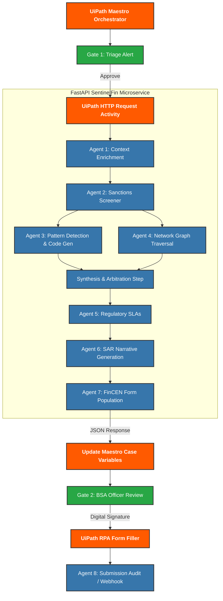

# SentinelFin: Agentic AML Compliance Backend

SentinelFin is a highly advanced Python microservice built for the UiPath AgentHack. It utilizes **Meta Llama 3.1 70B** (via AWS Bedrock) to dynamically write, execute, and evaluate Python logic on the fly to detect complex Anti-Money Laundering (AML) schemes, and automatically drafts FinCEN-compliant Suspicious Activity Reports (SARs).

This repository contains the intelligent backend designed to be directly orchestrated by **UiPath Maestro** via RESTful API calls.

## 💼 The Business Case

In 2024 alone, regulators levied over **$4.6 Billion** in AML fines globally. A core challenge for financial institutions is the strict legal mandate to file a Suspicious Activity Report (SAR) within **30 days** of detection. 

Currently, human analysts spend 4-12 hours manually gathering context and drafting narratives for a single case. **SentinelFin automates the investigative heavy-lifting**, turning a 6-hour process into a 10-second API call, ensuring deterministic, audit-traced decision making. Crucially, the UiPath Maestro orchestration guarantees humans remain exclusively in control at legally-required approval gates.

---

## 🏗 The Solution (What's Actually in this Repo)

To solve the "Black Box AI" problem in banking compliance, we built a **Dynamic Code Generation Engine** (Agent 3) and a **Regulatory Narrative Generator** (Agent 6). 

We explicitly avoided building a massive, simulated "8-agent" chatbot system. Instead, we built **One Real Slice** of enterprise intelligence, exposed as a FastAPI service so it can be natively invoked by UiPath Studio and orchestrated by UiPath Maestro.

### The 2 Core Agents
1. **Agent 3 (Pattern Detection):** When an alert fires, this agent takes the JSON transaction graph, asks Meta Llama 3.1 70B to dynamically generate custom Python code to detect layering/structuring, executes that code securely on the server, and returns a deterministic Risk Score (0-100).
2. **Agent 6 (SAR Narrative):** Takes the mathematical output of Agent 3 and uses the LLM to synthesize a highly structured, FinCEN-compliant legal narrative (Who, What, When, Where, Why, How).

### The UiPath Orchestration Architecture
> **Architectural Alignment:** Our Maestro orchestration is deliberately modeled after UiPath’s canonical best practices. As cited in UiPath's own May 2026 Maestro Case documentation: *"Financial crime investigations are hybrid. AML investigation runs as a case. Once the suspicious activity report (SAR) decision is made, SAR filing is a BPMN flow with deterministic controls."* SentinelFin strictly adheres to this: Stages 1–3 run as an open-ended Maestro Case with human-in-the-loop exception handling, and Stage 4 (FinCEN Filing) executes as a separate, deterministic BPMN flow.

The agents are exposed as **UiPath Coded Agents** natively running in Orchestrator.



1. **UiPath Maestro** receives a case.
2. Maestro triggers an **Action Center Task** (Gate 1: Triage).
3. Maestro uses an **HTTP Request** to hit our `POST /api/investigate` endpoint.
4. SentinelFin runs Agent 3 and Agent 6, returning the Risk Score and SAR Narrative.
5. Maestro suspends the workflow for **Gate 2: BSA Officer Review**.
6. Upon approval, UiPath RPA handles the physical filing.

---

## 🚀 Setup & Execution

### Prerequisites
1. Python 3.10+
2. AWS Bedrock Key (Meta Llama 3.1 70B enabled)
3. UiPath Studio (for workflow integration)

### Running the API Service
To start the FastAPI backend:
```bash
pip install -r requirements.txt
export AWS_BEDROCK_KEY="your-api-key"

# Start the uvicorn server
uvicorn main:app --reload
```
The API will be available at `http://localhost:8000/api/investigate`.

### The Developer UI Console (Streamlit)
To visualize the agents working without hooking up UiPath, we included a Streamlit console.
```bash
streamlit run app.py
```
*Note: This dashboard is a developer testing tool. In production, UiPath Action Center replaces this UI.*

---

## 🔌 UiPath Integration Guide
To wire this AI backend into UiPath:
1. Open UiPath Studio.
2. Drag an **HTTP Request** activity into your sequence.
3. Set the Endpoint to `http://localhost:8000/api/investigate`.
4. Set the Body to a JSON transaction payload (see `mock_data/scenario_layering.json`).
5. Deserialize the JSON response and map `risk_score` and `sar_narrative` into your Maestro Case variables.

See `UIPATH_INTEGRATION_GUIDE.md` for detailed instructions.
