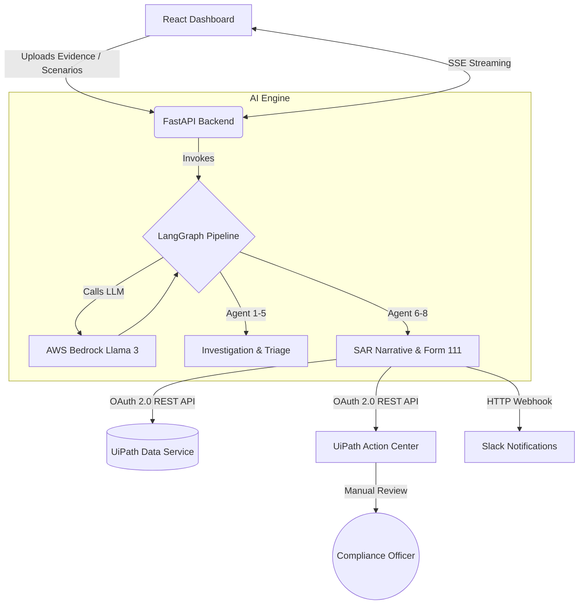

# SentinelFin: AML Investigation Pipeline

SentinelFin is a prototype Anti-Money Laundering (AML) application. It demonstrates how to orchestrate a complex AI investigation workflow while deeply integrating with the UiPath Automation Cloud for data persistence and human-in-the-loop (HITL) review.

> **🏅 Hackathon Track:** This project is submitted under the **UiPath Maestro BPMN Track**. The top-level governance is managed by a UiPath Maestro BPMN process, which delegates heavy unstructured cognitive reasoning to our external LangGraph AI engine, perfectly demonstrating the blend of UiPath-native orchestration with external LLM agents.

---

## 💡 Inspiration
Banks spend billions manually investigating AML alerts. A typical compliance analyst spends hours reviewing raw SWIFT logs, correlating entities, and drafting Suspicious Activity Reports (SARs) manually. This extreme bottleneck leads to SLA breaches and analyst burnout. We wanted to build a solution that doesn't just summarize text, but actively orchestrates a compliant investigation pipeline.

## 💻 What it does (The Data Pipeline)
SentinelFin ingests raw transactional data, processes it through specialized AI agents to determine risk, and prepares a SAR for final human review.

1. **Data Ingestion:** The user uploads raw evidence (e.g., a PDF bank statement or CSV) via the React dashboard.
2. **AI Processing (LangGraph):** The data is routed to a FastAPI backend where an 8-node LangGraph pipeline processes the case:
   - **Triage & Sanctions:** Checks entities against risk profiles.
   - **Pattern Detection:** Analyzes transactions for known money laundering typologies (e.g., Layering, Shell Companies).
   - **Narrative & Form Generation:** If the risk is high, the AI drafts a SAR narrative and maps the data strictly to the FinCEN Form 111 JSON schema.
3. **Real-time UI Updates:** As each agent completes its task, the backend streams the state to the frontend using Server-Sent Events (SSE), updating the dashboard in real-time.
4. **UiPath Handoff:** Once the AI completes the investigation, it securely pushes the data to UiPath for enterprise auditing and human approval.

## 🏗️ Architecture Diagram



## ⚙️ How we built it (Tech Stack & Integrations)

### 🏆 Bonus: Built with UiPath for Coding Agents
**We are claiming the Coding Agent bonus points!** This entire 8-Agent LangGraph architecture, the React dashboard, the live Server-Sent Events (SSE) streaming, and the live OAuth 2.0 REST API connections to UiPath Cloud were collaboratively architected and built using **UiPath for Coding Agents (Gemini/Antigravity CLI)**. The coding agent acted as our co-pilot, generating the complex FastAPI asynchronous routing and helping us navigate the UiPath Orchestrator REST API documentation.

### The Core Stack
- **Backend:** Python, FastAPI, LangGraph (Multi-Agent State Machine)
- **Frontend:** React, Vite, Server-Sent Events (SSE)
- **LLM:** AWS Bedrock (Llama 3.1 70B)

### UiPath Integrations
We integrated directly with several UiPath services to handle the enterprise routing and review process:

1. **UiPath Action Center (Orchestrator REST API):** 
   - **Usage:** When the pipeline finishes generating the SAR, it executes an OAuth 2.0 authenticated POST request to the Orchestrator API (`/odata/Tasks/UiPath.Server.Configuration.OData.CreateExternalTask`).
   - **Purpose:** Creates a real "External Task" in Action Center so a human compliance officer can review and approve the AI-generated report before it is legally filed.
2. **UiPath Data Service (REST API):**
   - **Usage:** The pipeline uses the Data Service OData REST API to push the extracted entities and transaction metadata into a cloud entity.
   - **Purpose:** Ensures that all evidence and AI decisions are stored in a centralized, auditable database.
3. **UiPath Clipboard AI:**
   - **Usage:** The dashboard formats the extracted FinCEN Form 111 data into a strict key-value text format and copies it to the clipboard.
   - **Purpose:** Allows compliance officers to use Clipboard AI to intelligently paste the structured data directly into legacy banking terminal interfaces that do not support APIs.
4. **UiPath Autopilot (Simulated Concept):**
   - **Usage:** A contextual chat widget embedded in the dashboard.
   - **Purpose:** Demonstrates how analysts can use Autopilot to ask questions about the current case's transaction graph (e.g., "Why was this risk score high?").

## 🚧 Challenges we ran into
Integrating a fully autonomous LangGraph pipeline with an asynchronous enterprise platform like UiPath Action Center was challenging. We had to ensure the AI gracefully paused its execution state while handling the OAuth 2.0 Bearer token lifecycle securely inside our Python microservice.

## 🏆 Accomplishments that we're proud of
1. **Live SSE Streaming:** Watching the React dashboard update in real-time as the 8 agents process the transactional graph provides total transparency to the end-user.
2. **Authentic API Integration:** We successfully connected our external Python application directly to the live UiPath Cloud APIs for Action Center and Data Service using proper OAuth client credentials.

## 📖 What we learned
We learned the immense value of combining Agentic AI frameworks with Robotic Process Automation (RPA). AI is brilliant at unstructured reasoning, but it lacks the guardrails, auditability, and deterministic routing that UiPath provides. Combining them creates a highly resilient enterprise solution.

## 🚀 What's next for SentinelFin
- **Native Orchestrator Webhooks:** Building webhooks to resume the LangGraph execution the moment a human clicks "Approve" in Action Center.
- **Document Understanding:** Integrating UiPath Document Understanding to natively OCR the massive PDF bank statements before feeding them into Bedrock.

---

## 🛠️ Setup & Execution

### 1. Environment Configuration
Create a `.env` file in the root directory:
```env
# AWS Credentials for LLM Processing
AWS_ACCESS_KEY_ID=...
AWS_SECRET_ACCESS_KEY=...
AWS_DEFAULT_REGION=us-east-1
BEDROCK_MODEL_ID=us.meta.llama3-1-70b-instruct-v1:0

# External Integrations
SLACK_WEBHOOK_URL=https://hooks.slack.com/services/...

# UiPath API Credentials
UIPATH_CLIENT_ID=your-client-id
UIPATH_CLIENT_SECRET=your-client-secret
UIPATH_ORG=your-org-name
UIPATH_TENANT=DefaultTenant
```

### 2. Run the Application
Start the FastAPI backend and React frontend simultaneously using the provided script:
```bash
bash ./start_demo.sh
```
Navigate to `http://localhost:5173/` to use the application.
