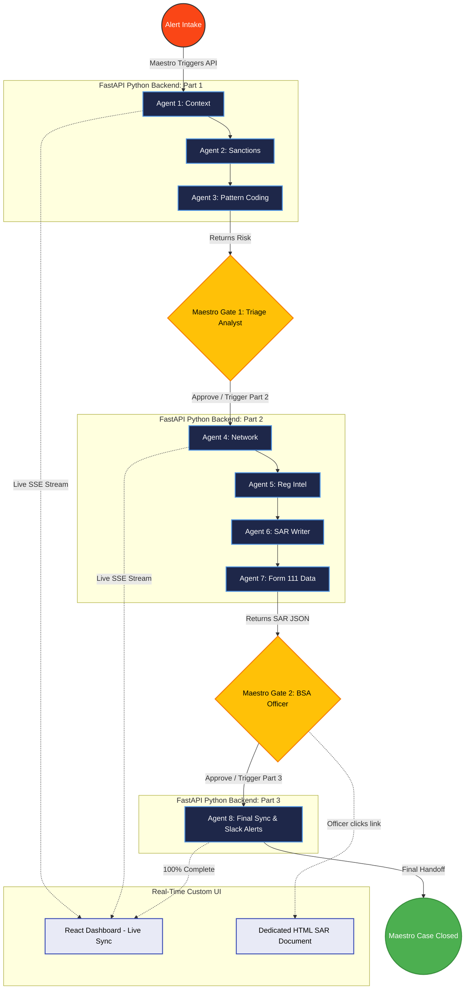

# SentinelFin: AML Investigation Pipeline

SentinelFin is a prototype Anti-Money Laundering (AML) application. It demonstrates how to orchestrate a complex AI investigation workflow while deeply integrating with the UiPath Automation Cloud for data persistence and human-in-the-loop (HITL) review.

> **🏅 Hackathon Track:** This project is submitted under **Track 1: UiPath Maestro Case**. SentinelFin orchestrates a dynamic, exception-heavy AML investigation using UiPath case management capabilities. Because financial crime investigations have unpredictable paths and require moving work through distinct stages (Intake ➔ Investigation ➔ SAR Filing), a Maestro Case acts as the top-level orchestrator. It seamlessly manages handoffs between my external LangGraph AI agents, enterprise UiPath APIs, and human BSA Officers—keeping humans in charge at key decision points.


---

## 1. Project Description (What it does & The Problem)
**The Problem:** Over the last two years, global regulators handed down nearly $7 Billion in Anti-Money Laundering (AML) fines. To avoid these fines, banks hire armies of compliance analysts who spend several hours manually jumping between disconnected legacy silos, rigid CSV exports, and cryptic SWIFT messages just to draft a single Suspicious Activity Report (SAR). This causes extreme analyst burnout and missed deadlines.

**What it does:** SentinelFin doesn't just summarize text—it actively orchestrates the entire compliant investigation pipeline. By using a massive 8-Agent Llama 3.1 architecture strictly governed by UiPath Maestro, I reduce the investigation and drafting time of a legally-complex SAR from **several hours to under 5 minutes**. This saves millions in operational overhead and allows human BSA Officers to focus purely on the final legal review rather than manual data entry.

## 2. Agent Type Declaration
**Agent Type:** This solution utilizes a custom, external **LangGraph/Python Agent framework** rather than native UiPath Coded Agents or Low-code Agents. The AI reasoning happens externally via Python microservices, while UiPath Maestro acts as the strict enterprise governor and orchestrator. 
*(Note: I did heavily utilize the **UiPath Antigravity CLI** coding agent to co-pilot the development of the Python OData APIs. See the CODING_AGENTS.md file for the bonus points claim).*

## 3. UiPath Components Used
I integrated directly with several UiPath services to handle the enterprise routing and review process:
- **UiPath Maestro (Process Orchestration):** Serves as the central brain of the investigation. It triggers the Python AI backend, waits for the multi-agent system to complete its tasks, and natively manages the routing of data between human decision gates.
- **UiPath Action Center (Human-in-the-Loop):** Maestro creates native Form Tasks to present the AI's findings (Gate 1: Triage, Gate 2: BSA Sign-off). The AI cannot proceed without human approval.
- **UiPath Data Service:** Used to store the finalized FinCEN Form 111 JSON payload and the immutable audit trail of the investigation.
- **UiPath Autopilot:** Used to query finalized, closed cases to instantly summarize massive SAR documents and query specific historical transaction details.
- **UiPath Integration Service (Slack / Jira):** Dispatches the final alerts to enterprise communication channels once the BSA Officer approves the SAR.

---

## 💻 The Data Pipeline (How it works)
1. **Data Ingestion:** The user uploads raw evidence (e.g., a PDF bank statement or CSV) via the React dashboard.
2. **AI Processing (The 8-Agent Team):** The data is routed to a FastAPI backend where a multi-agent pipeline processes the case:
   - **Agent 1 (Transaction Context):** Normalizes the data.
   - **Agent 2 (Sanctions & PEP Screener):** Cross-references against OFAC and FBI lists.
   - **Agent 3 (Pattern Detection - Coding Agent):** Calls Llama 3.1 to write a custom Python detection script on the fly to detect specific layering typologies, executes the code safely, and calculates a risk score.
   - **Agent 4 (Network Investigation):** Maps offshore shell company networks.
   - **Agent 5 (Regulatory Intelligence):** Determines FinCEN SLA deadlines.
   - **Agent 6 (SAR Narrative Writer):** Drafts a highly professional, 5-page FinCEN-compliant SAR narrative.
   - **Agent 7 (SAR Form Population):** Maps the data into the FinCEN Form 111 JSON schema.
   - **Agent 8 (Submission):** Generates the audit trail, syncs to UiPath Data Service, and triggers Slack alerts.
3. **Real-time UI Updates:** As the Python backend executes, it streams the state to the frontend using Server-Sent Events (SSE).

## 🏗️ Architecture Diagram



## 🚀 What's next for SentinelFin
I am expanding SentinelFin from a reactive investigation tool into a **proactive, global defense grid**. 
1. **Federated Learning Consortium:** Building a consortium via UiPath Data Service to allow global banks to securely share anonymized transactional topologies without compromising customer privacy.
2. **Autonomous Asset Freezing:** Expanding my Dynamic Coding Agent so that the exact millisecond a BSA Officer signs the final SAR in Action Center, SentinelFin uses UiPath RPA to immediately execute API calls across decentralized ledgers to freeze illicit funds in real-time.

---

## 4. Setup Instructions (Configuration & Execution)

### Environment Configuration
Create a `.env` file in the root directory:
```env
# AWS Credentials for LLM Processing
AWS_ACCESS_KEY_ID=...
AWS_SECRET_ACCESS_KEY=...
AWS_DEFAULT_REGION=us-east-1
BEDROCK_MODEL_ID=us.meta.llama3-1-70b-instruct-v1:0

# External Integrations
SLACK_WEBHOOK_URL=https://hooks.slack.com/services/...

# UiPath API Credentials
UIPATH_CLIENT_ID=your-client-id
UIPATH_CLIENT_SECRET=your-client-secret
UIPATH_ORG=your-org-name
UIPATH_TENANT=DefaultTenant
```

### Run the Application
Start the FastAPI backend and React frontend simultaneously using the provided script:
```bash
bash ./start_demo.sh
```
Navigate to `http://localhost:5173/` to use the application.
